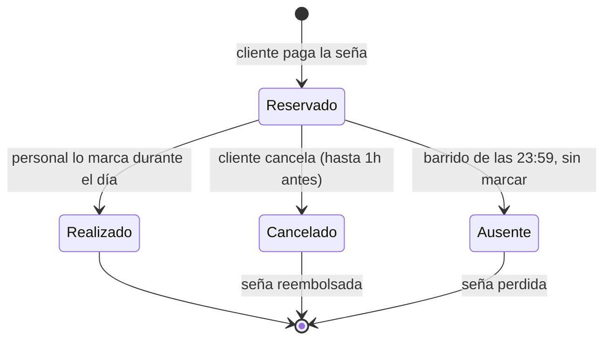
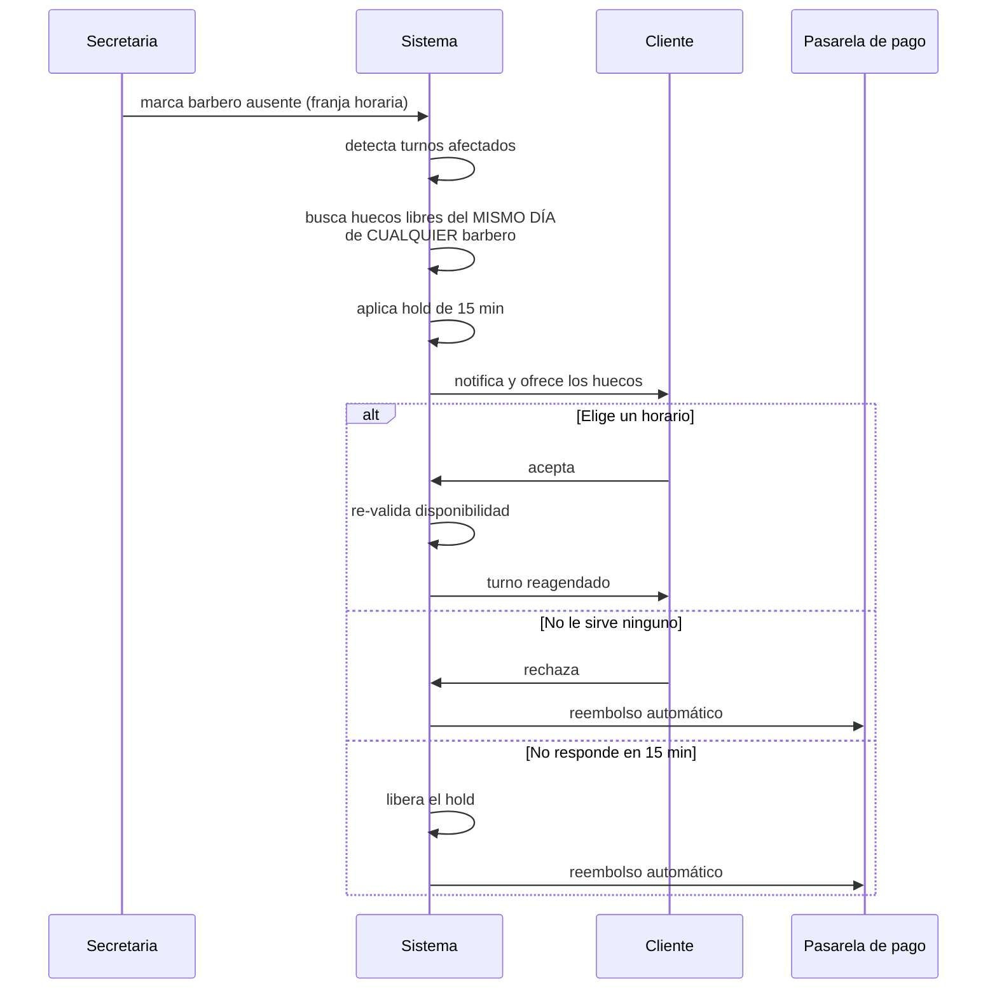

# Software JC Barbería — Turnero Digital

Sistema de gestión de turnos para **JC Barbería**, una barbería real de Córdoba Capital, Argentina.

Este documento es la fuente de verdad de la **lógica de negocio** del proyecto. Todo cambio o decisión que se tome queda reflejado acá, para que cualquier persona del equipo entienda **qué problema resolvemos, con qué reglas y por qué**.

---

## Índice

- [1. El problema](#1-el-problema)
- [2. Qué construimos](#2-qué-construimos)
- [3. Reglas de negocio](#3-reglas-de-negocio)
  - [3.1 Seña y cancelación](#31-seña-y-cancelación)
  - [3.2 Ciclo de vida del turno](#32-ciclo-de-vida-del-turno)
  - [3.3 El hold de 15 minutos](#33-el-hold-de-15-minutos)
  - [3.4 Ausencia del barbero](#34-ausencia-del-barbero)
  - [3.5 Barrido diario de las 23:59](#35-barrido-diario-de-las-2359)
  - [3.6 Operación del local](#36-operación-del-local)
- [4. Alcance del MVP](#4-alcance-del-mvp)
- [5. Decisiones técnicas tomadas](#5-decisiones-técnicas-tomadas)
- [6. Riesgos conocidos](#6-riesgos-conocidos)
- [7. Trabajo futuro](#7-trabajo-futuro)
- [8. Decisiones abiertas](#8-decisiones-abiertas)
- [9. Estado del proyecto](#9-estado-del-proyecto)
- [10. Cómo trabajamos](#10-cómo-trabajamos)

---

## 1. El problema

Hoy la barbería funciona **100% con teléfono y papel**. La secretaria atiende las llamadas, anota los turnos en un cuaderno, y cualquier cambio se resuelve llamando al cliente. No se usa WhatsApp ni mensajes.

Eso genera tres problemas concretos:

**No hay una fuente de verdad consultable.** El cuaderno es una copia única que se escribe a mano. Nadie puede ver la agenda en tiempo real desde otro lado.

**Cuando falta un barbero, se rompe todo.** La secretaria tiene que revisar el cuaderno para ver qué turnos quedaron colgados, llamar uno por uno a cada cliente, y cruzar a mano las agendas de los otros barberos buscando un hueco. Cada ausencia le puede consumir entre 30 y 90 minutos de llamadas, casi siempre el mismo día y a las apuradas. Si no llega a algún cliente, ese cliente aparece en el local y no hay silla — el peor escenario posible.

**No hay compromiso del cliente.** Reservar no cuesta nada, así que faltar tampoco. Un turno vacío de 30 o 45 minutos no se recupera: es una pérdida directa. Además, solo se puede reservar en horario de secretaria, con lo cual se pierde toda la demanda de noches y fines de semana, que es justo cuando la gente piensa en cortarse el pelo.

> **Referencia de industria:** los negocios de servicios sin seña ni recordatorio suelen tener 15-20%+ de ausencias. Con seña + recordatorio, eso baja a 3-5% en 30-60 días.

---

## 2. Qué construimos

Un **turnero digital** con dos caras:

| Cara | Para quién | Qué resuelve |
|------|-----------|--------------|
| **Web pública** | Clientes | Reservar turno con seña, cancelar, ver sus turnos |
| **Panel admin** | Dueño y secretaria | Crear/editar/cancelar turnos, marcar realizados, manejar ausencias de barberos, configurar horarios y precios |

---

## 3. Reglas de negocio

### 3.1 Seña y cancelación

| Regla | Valor |
|-------|-------|
| Seña | **50% fijo** del precio del servicio, igual para todos los servicios |
| Momento del cobro | Al reservar |
| Ventana de cancelación del cliente | Hasta **1 hora antes** del turno |
| Cancelación dentro de la ventana | Reembolso automático |
| Cancelación fuera de la ventana o ausencia | **Se pierde la seña** |
| Procesamiento del reembolso | **Siempre automático** por la pasarela, sin aprobación manual |

### 3.2 Ciclo de vida del turno

Un turno tiene estados **explícitos y separados**. Nunca se mezclan: la diferencia entre "cancelado" y "ausente" define si la plata vuelve o no.



| Estado | Qué significa | Qué pasa con la seña |
|--------|---------------|----------------------|
| **Reservado** | Turno confirmado y señado | Retenida |
| **Realizado** | El corte se hizo; alguien lo marcó desde el panel | Se aplica al pago del servicio |
| **Cancelado** | El cliente canceló a tiempo, o canceló el local | Reembolso automático |
| **Ausente** | Pasó la hora y nadie lo marcó como realizado | **Se pierde** |

### 3.3 El hold de 15 minutos

Este es el mecanismo que evita que **dos clientes se peleen por el mismo horario**.

**El problema que resuelve:** entre que el sistema le muestra un horario libre a alguien y esa persona confirma, otro cliente puede haberlo tomado. Sin protección, terminás con dos turnos en la misma silla a la misma hora.

**Cómo funciona:**

1. Cuando se le ofrece un horario a un cliente, el sistema lo marca como **retenido provisoriamente** por 15 minutos.
2. Durante esos 15 minutos, **nadie más puede tomar ese horario** desde la web.
3. Si el cliente confirma dentro de la ventana → el turno se agenda.
4. Si no responde → el hold se libera solo y el horario vuelve a estar disponible.
5. **Justo antes de confirmar**, el sistema vuelve a validar que el horario siga libre. Si por algún cruce ya no lo está, ofrece automáticamente el siguiente más cercano de ese mismo día.

> **Importante:** el hold **no** es exclusivo del flujo de ausencia del barbero. Es infraestructura base del sistema de reservas: aplica igual cuando dos clientes cualquiera compiten por el mismo horario desde la web.

### 3.4 Ausencia del barbero

Cuando un barbero falta o llega tarde, la secretaria lo marca como no disponible para una franja horaria. A partir de ahí el sistema se encarga.



**Reglas del flujo:**

- Se ofrecen huecos **solo de ese mismo día**. Si el cliente quiere otro día, se le devuelve la seña y reserva de nuevo cuando quiera.
- Se ofrecen huecos de **cualquier barbero**, no solo del que faltó. Todos hacen todos los servicios, así que ampliar el abanico aumenta las chances de que el cliente acepte en vez de irse.
- **Nunca se tocan turnos ya agendados de otros clientes.** El sistema solo ofrece huecos genuinamente libres. No hay reprogramación en cascada.
- Como la cancelación es culpa del local, el cliente **nunca pierde la seña** en este flujo.

### 3.5 Barrido diario de las 23:59

Durante el día, el personal marca los turnos como **realizados** desde el panel.

Todos los días a las **23:59 (hora Argentina, UTC-3 fijo, sin horario de verano)** corre un proceso automático:

> Todo turno con seña pagada que **no** fue marcado como realizado pasa a estado **ausente**, y la seña **no se devuelve**.

**Por qué es híbrido:** el marcado manual permite distinguir un cliente que vino de uno que no. El barrido automático evita que la secretaria tenga que marcar ausencias una por una al cierre.

⚠️ **Este mecanismo tiene un riesgo operativo real.** Ver [Riesgos conocidos](#6-riesgos-conocidos).

### 3.6 Operación del local

| Aspecto | Regla |
|---------|-------|
| Barberos | Varios, **cada uno con su propio horario y días libres** |
| Servicios | **Todos los barberos hacen todos los servicios** (sin especialidades) |
| Walk-ins | **Conviven** con los turnos digitales. El sistema debe poder marcar un hueco como ocupado por walk-in para que no se pise con una reserva online |
| Horario del local | Fijo en general, pero **modificable** desde el panel admin |
| Configurable desde el panel | Horarios del local, horarios de cada barbero, precios de los servicios |

---

## 4. Alcance del MVP

### Adentro

- Cuenta de cliente **obligatoria** (permite historial de turnos y seguimiento de ausencias)
- Reserva desde la web con seña del 50%
- Cancelación del cliente desde la web (hasta 1h antes) con reembolso automático
- Hold de 15 minutos como infraestructura de reservas
- Ciclo de vida completo del turno con el barrido de las 23:59
- Flujo de ausencia del barbero
- Panel admin: crear turnos telefónicos, editar, cancelar, marcar realizados, ocupación por walk-in
- Configuración de horarios (local y por barbero) y precios
- Disponibilidad modelada **por barbero**
- Notificaciones detrás de un puerto (ver [Decisiones técnicas](#5-decisiones-técnicas-tomadas))

### Afuera

Inventario de productos · Sueldos y comisiones · POS completo del corte · Programas de fidelización · Marketing masivo · Multi-sucursal · Reportes y analítica avanzada · Reseñas y calificaciones

---

## 5. Decisiones técnicas tomadas

| Decisión | Elección | Por qué |
|----------|----------|---------|
| Pasarela de pago | **MercadoPago** | Medio de pago dominante en Argentina; cobra la seña y procesa los reembolsos automáticos |
| Identidad del cliente | **Cuenta obligatoria** | Habilita historial y seguimiento de ausencias reincidentes |
| Canal de notificación (objetivo) | **WhatsApp Business API** | Mejor adopción en Argentina y más barato por mensaje |
| Canal de notificación (MVP) | **Email vía Gmail** — provisorio | WhatsApp requiere verificación de Meta Business + proveedor pago (BSP) con tiempo de alta real, que bloquearía la demo |
| Stack | **Sin definir** | Se decide en la fase de diseño |

### El puerto de notificaciones

**Esto es obligatorio, no opcional.** El canal de notificación va **detrás de un puerto (patrón adapter)**.

El dominio dice *"notificá al cliente que su turno se canceló"* y no sabe si eso sale por mail, por WhatsApp o por paloma mensajera.

```
      Dominio                 Puerto                 Adaptadores
┌─────────────────┐    ┌──────────────────┐    ┌─────────────────┐
│  "notificar al  │───▶│  NotificationPort │───▶│  Gmail   (MVP)  │
│     cliente"    │    │   (interfaz)      │    │  WhatsApp (fut.)│
└─────────────────┘    └──────────────────┘    └─────────────────┘
```

Migrar a WhatsApp tiene que ser **cambiar de adaptador y configuración**, nunca reescribir la lógica de turnos.

### Procesos de fondo

El sistema necesita **ejecución programada confiable**. No es un detalle: son tres procesos independientes que corren solos.

1. **Vencimiento del hold** — cada 15 minutos por hold, libera el horario y dispara el reembolso
2. **Barrido de ausencias** — todos los días a las 23:59 hora Argentina
3. **Recordatorios de turno** — antes de cada turno

Esto es un **requisito de arquitectura** que el stack elegido tiene que soportar bien.

---

## 6. Riesgos conocidos

| Riesgo | Impacto | Mitigación |
|--------|---------|------------|
| **El personal se olvida de marcar un turno como realizado** | El barrido de las 23:59 lo pasa a *ausente* y un cliente que **sí vino** pierde la seña. Reclamo asegurado | Propuesta: que el admin pueda corregir el estado retroactivamente + un listado de cierre de día con los turnos sin marcar. **Todavía sin decidir si entra al MVP** |
| **Turno telefónico vs cuenta obligatoria + seña online** | Un cliente que llama no tiene cuenta ni puede pagar online en medio de la llamada | Propuesta: la secretaria crea o busca un registro mínimo del cliente y marca la seña como cobrada en persona. **Requiere confirmación del dueño** |
| **Límites de Gmail** | ~500 envíos/día en cuentas gratuitas, requiere App Password, mala entregabilidad desde casilla personal | Aceptado conscientemente para la demo. El puerto hace que migrar sea barato |
| **Email tiene la peor tasa de apertura** para cambios del mismo día | Un cliente puede no enterarse a tiempo de que su barbero faltó | Aceptado como tradeoff temporal hasta migrar a WhatsApp |
| **Zona horaria del barrido de las 23:59** | Si corre en hora del servidor o UTC, marca ausencias en el momento equivocado | Debe usar offset fijo de Argentina (UTC-3, sin horario de verano). Restricción para la fase de diseño |

---

## 7. Trabajo futuro

Documentado para que no se pierda:

- **Migración a WhatsApp Business API** como canal principal (requiere verificación de Meta Business + alta con un BSP pago)
- **Reprogramación en el lugar** para el cliente, manteniendo la misma seña (hoy: solo cancelar y reservar de nuevo)
- **Resolución definitiva del turno telefónico** (cuenta mínima + seña en persona)
- **Recordatorio de cierre de día** con turnos sin marcar + corrección retroactiva de estado
- **Activar TDD estricto** una vez que haya stack y test runner

---

## 8. Decisiones abiertas

Estas están **sin resolver** y frenan el avance a la fase de especificación:

1. **Turno telefónico** — cómo se maneja un cliente que llama y no tiene cuenta ni puede pagar online. Hay recomendación escrita, falta confirmación del dueño.
2. **Mitigación del barrido de las 23:59** — si la corrección retroactiva + el aviso de fin de día entran al MVP o quedan como trabajo futuro.
3. **Regla de `openspec/config.yaml`** — dice que el stack se define en la primera propuesta, pero se decidió dejarlo para la fase de diseño. Falta corregir la redacción.

---

## 9. Estado del proyecto

| Fase | Estado |
|------|--------|
| Inicialización (SDD) | ✅ Completa |
| Exploración del problema | ✅ Completa |
| Decisiones de negocio | ✅ Cerradas (3 rondas con el dueño) |
| Propuesta | ✅ Completa |
| Especificación | ⏸️ Frenada por las decisiones abiertas |
| Diseño técnico | ⏸️ Frenada por las decisiones abiertas |
| Implementación | ⬜ Sin empezar |

**Todavía no hay código.** El stack se elige en la fase de diseño.

---

## 10. Cómo trabajamos

El proyecto usa **SDD (Spec-Driven Development)**: primero se entiende el problema, después se escriben las reglas, recién al final se escribe código.

```
exploración → propuesta → especificación → diseño → tareas → implementación → verificación
```

Los artefactos de cada fase viven en `openspec/changes/<nombre-del-cambio>/`.

### Convenciones

**Commits:** [Conventional Commits](https://www.conventionalcommits.org/). Cada decisión de negocio o cambio de alcance va con su commit y su actualización de este README.

```
docs: documentar el hold de 15 minutos
feat: agregar cancelación desde el panel admin
fix: corregir zona horaria del barrido diario
```

**Idiomas:** la documentación y el README van en **español**. El código (nombres de variables, funciones, comentarios, mensajes de la interfaz) va en **inglés**.

### Estructura

```
.
├── README.md              ← este documento: la lógica de negocio
├── openspec/
│   ├── config.yaml        ← configuración del flujo SDD
│   └── changes/           ← artefactos por cambio (propuesta, specs, diseño, tareas)
└── .atl/                  ← registro de skills de la herramienta
```
