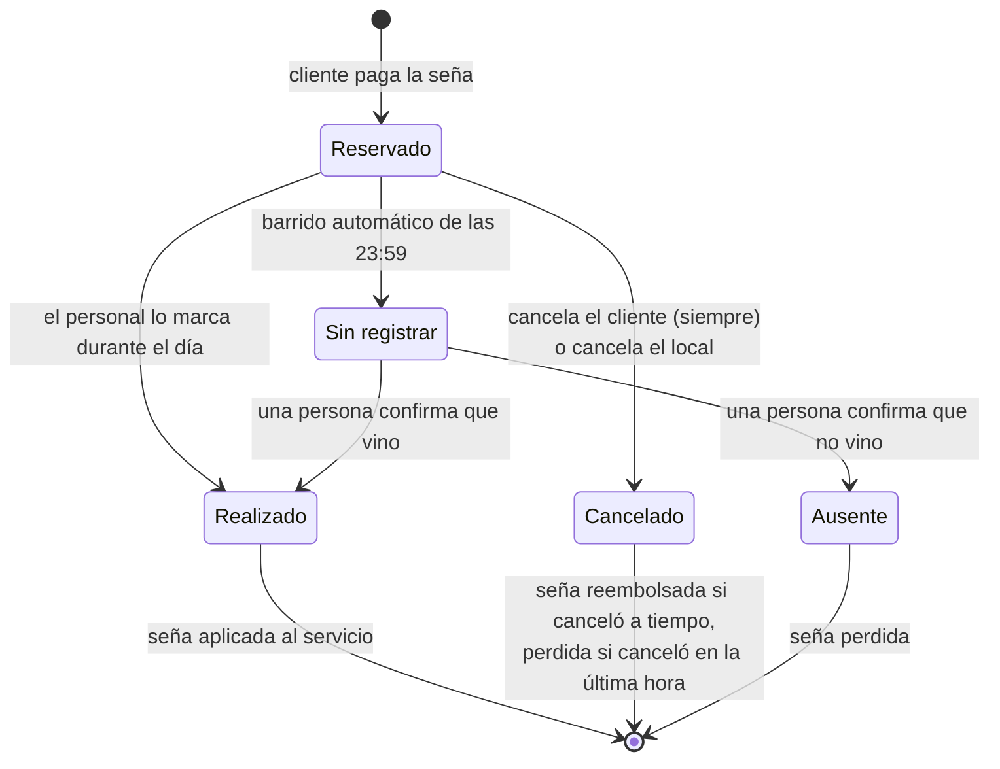
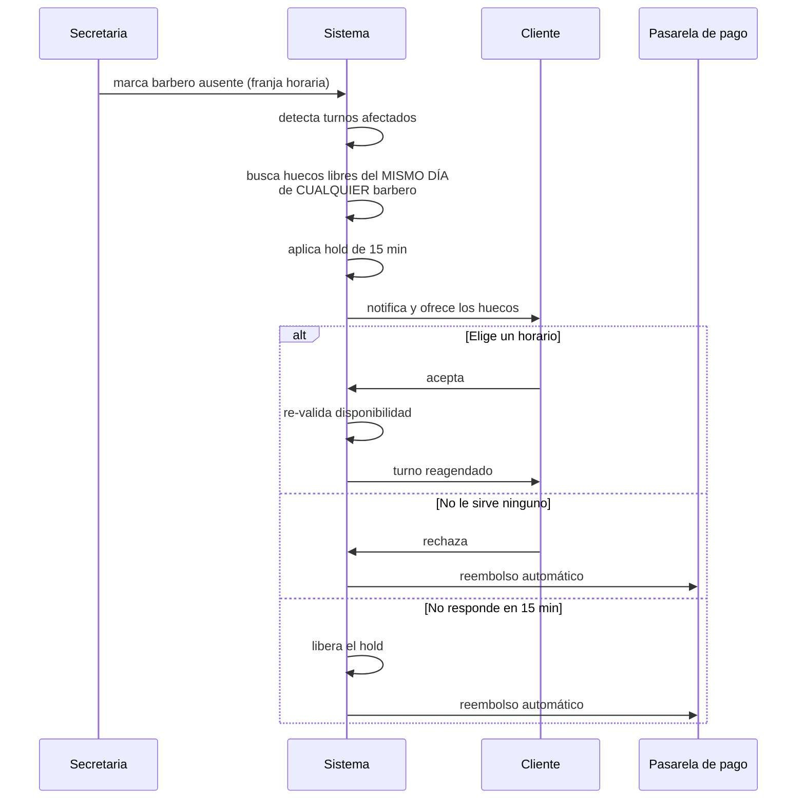

# Software JC Barbería — Turnero Digital

Sistema de gestión de turnos para **JC Barbería**, una barbería real de Córdoba Capital, Argentina.

Este documento es la fuente de verdad de la **lógica de negocio** del proyecto. Todo cambio o decisión que se tome queda reflejado acá, para que cualquier persona del equipo entienda **qué problema resolvemos, con qué reglas y por qué**.

> Para levantar el proyecto y ver una demo funcionando, ver [`docs/DEMO.md`](docs/DEMO.md).

---

## Índice

- [1. El problema](#1-el-problema)
- [2. Qué construimos](#2-qué-construimos)
- [3. Reglas de negocio](#3-reglas-de-negocio)
  - [3.1 Seña y cancelación](#31-seña-y-cancelación)
  - [3.2 Ciclo de vida del turno](#32-ciclo-de-vida-del-turno)
  - [3.3 El hold de 15 minutos](#33-el-hold-de-15-minutos)
  - [3.4 Ausencia del barbero](#34-ausencia-del-barbero)
  - [3.5 Barrido diario de las 23:59 y turnos sin registrar](#35-barrido-diario-de-las-2359)
  - [3.6 Operación del local](#36-operación-del-local)
  - [3.7 Cuenta del cliente](#37-cuenta-del-cliente)
  - [3.8 Roles y permisos](#38-roles-y-permisos)
  - [3.9 Perfil del barbero](#39-perfil-del-barbero)
- [4. Alcance del MVP](#4-alcance-del-mvp)
- [5. Decisiones técnicas tomadas](#5-decisiones-técnicas-tomadas)
- [6. Riesgos conocidos](#6-riesgos-conocidos)
- [7. Trabajo futuro](#7-trabajo-futuro)
- [8. Decisiones abiertas](#8-decisiones-abiertas)
- [9. Estado del proyecto](#9-estado-del-proyecto)
  - [Por qué hay un segundo tracker](#por-qué-hay-un-segundo-tracker)
  - [Lo que funciona hoy](#lo-que-funciona-hoy-verificado-desde-la-pantalla)
  - [Lo que falta](#lo-que-falta)
- [10. Cómo se construyó](#10-cómo-se-construyó)
  - [Sobre el tamaño de los PRs](#sobre-el-tamaño-de-los-prs)
  - [La lección del proyecto](#la-lección-del-proyecto)
- [11. Cómo trabajamos](#11-cómo-trabajamos)

---

## 1. El problema

Hoy la barbería funciona **100% con teléfono y papel**. La secretaria atiende las llamadas, anota los turnos en un cuaderno, y cualquier cambio se resuelve llamando al cliente. No se usa WhatsApp ni mensajes.

Eso genera tres problemas concretos:

**No hay una fuente de verdad consultable.** El cuaderno es una copia única que se escribe a mano. Nadie puede ver la agenda en tiempo real desde otro lado.

**Cuando falta un barbero, se rompe todo.** La secretaria tiene que revisar el cuaderno para ver qué turnos quedaron colgados, llamar uno por uno a cada cliente, y cruzar a mano las agendas de los otros barberos buscando un hueco. Cada ausencia le puede consumir entre 30 y 90 minutos de llamadas, casi siempre el mismo día y a las apuradas. Si no llega a algún cliente, ese cliente aparece en el local y no hay silla — el peor escenario posible.

**No hay compromiso del cliente.** Reservar no cuesta nada, así que faltar tampoco. Un turno vacío de 30 o 45 minutos no se recupera: es una pérdida directa. Además, solo se puede reservar en horario de secretaria, con lo cual se pierde toda la demanda de noches y fines de semana, que es justo cuando la gente piensa en cortarse el pelo.

> **Referencia de industria:** los negocios de servicios sin seña ni recordatorio suelen tener 15-20%+ de ausencias. Con seña + recordatorio, eso baja a 3-5% en 30-60 días.

---

## 2. Qué construimos

Un **turnero digital** con tres caras:

| Cara | Para quién | Qué resuelve |
|------|-----------|--------------|
| **Web pública** | Clientes | Reservar turno con seña, cancelar, ver sus turnos |
| **Panel admin** | Dueño y secretaria | Crear/editar/cancelar turnos, marcar realizados, resolver turnos sin registrar, manejar ausencias de barberos, cargar walk-ins, gestionar clientes y barberos, configurar horarios y precios |
| **Perfil del barbero** | Cada barbero | Su agenda del día, sus cortes hechos, lo que facturó |

**El sistema es híbrido a propósito**, pero los canales no están al mismo nivel.

La web es **el camino principal**. El teléfono queda como **excepción**: para el cliente que tiene un problema concreto o que realmente no puede con la web. Al entregar el MVP se le va a pedir al dueño que empuje activamente a su clientela hacia la web, y que deje la llamada como último recurso.

Esa jerarquía importa: si el teléfono se usa como canal paralelo cómodo en vez de como salida de emergencia, la seña deja de cumplir su función y el ausentismo sigue igual que antes.

---

## 3. Reglas de negocio

### 3.1 Seña y cancelación

| Regla | Valor |
|-------|-------|
| Seña | **50% fijo** del precio del servicio, igual para todos los servicios |
| Momento del cobro | Al reservar |
| Cancelación del cliente | **Siempre permitida**, hasta el momento mismo del turno |
| Cancelación hasta **1 hora antes** | Reembolso automático |
| Cancelación dentro de la última hora | **Se pierde la seña**, pero el turno se libera igual |
| Ausencia confirmada por una persona | **Se pierde la seña** |
| Procesamiento del reembolso | **Siempre automático** por la pasarela, sin aprobación manual |

> **La ventana de 1 hora decide la plata, no el permiso.** Antes el sistema rechazaba la cancelación tardía, y el resultado era el peor de los dos mundos: el local se quedaba sin la hora *y* sin la chance de revenderla, porque el turno seguía ocupado por alguien que ya había avisado que no venía. Ahora el hueco vuelve a estar disponible siempre; lo único que cambia al cruzar la hora límite es que la seña no se devuelve.

**La seña solo se cobra en la web.** Durante la transición del papel a lo digital va a seguir entrando mucha llamada, y frenar esos turnos para cobrar una seña por teléfono sería ponerle un palo en la rueda al negocio. La estrategia es **empujar a los clientes hacia la web**, no castigar al que llama.

| Canal | ¿Lleva seña? | Rol |
|-------|-------------|-----|
| Web | ✅ 50% | Camino principal |
| Teléfono (carga la secretaria) | ❌ Por ahora no | Excepción, último recurso |
| Walk-in | ❌ Nunca | Atención espontánea |

La adopción de la web se maneja **por acuerdo con el dueño, no por restricción del sistema**: nada en el software impide reservar por teléfono. Si las llamadas no bajan, la palanca es comercial antes que técnica.

> **El canal decide si hay seña, nunca el cliente.** Si reserva por la web, la seña es **obligatoria**: no existe la opción de reservar sin pagarla. Por teléfono y walk-in no se cobra, y tampoco es una elección — sencillamente no aplica en esos canales.
>
> **Consecuencia para el diseño:** como conviven turnos con seña y turnos sin seña, toda la lógica que la toca — reembolso por cancelación, pérdida por ausencia, reembolso automático al vencer un hold — tiene que funcionar igual cuando no hay nada que devolver. No es un caso raro: van a ser la mayoría de los turnos al principio.
>
> ⚠️ **No la llamemos "seña opcional".** Esa palabra sugiere que el cliente puede saltearla, y llevaría a construir un checkout con un "pagar después" que no existe en ninguna regla del negocio.

**El recordatorio sale 2 horas antes del turno.** Como la ventana de cancelación cierra 1 hora antes, ese aviso es **la última oportunidad del cliente para cancelar y recuperar la seña**. El mensaje tiene que decirlo explícitamente, con la hora límite: si el cliente no lo lee a tiempo, pierde la plata sin haber tenido la chance de decidir.

> Con el canal actual esto queda ajustado: el correo tiene la peor tasa de apertura justo para avisos del mismo día, y 2 horas es una ventana corta para que alguien abra el mail. La elección funciona mucho mejor cuando migremos a WhatsApp, donde los mensajes se leen al instante. Es un motivo más para no quedarse en Gmail más de lo necesario.

### 3.2 Ciclo de vida del turno

Un turno tiene estados **explícitos y separados**. Nunca se mezclan: la diferencia entre "cancelado" y "ausente" define si la plata vuelve o no.



| Estado | Qué significa | Qué pasa con la seña |
|--------|---------------|----------------------|
| **Reservado** | Turno confirmado y señado | Retenida |
| **Realizado** | El corte se hizo; alguien lo marcó desde el panel | Se aplica al pago del servicio |
| **Cancelado** | El cliente canceló, o canceló el local | Reembolso automático si fue hasta 1h antes; **se pierde** si fue dentro de la última hora |
| **Sin registrar** | Pasó el día y nadie lo marcó. **No sabemos qué pasó** | Retenida, sin cambios |
| **Ausente** | Una persona confirmó que el cliente no vino | **Se pierde** (si no había seña, queda solo el registro) |

> **La regla que sostiene todo esto:** el sistema **nunca** marca a alguien como ausente por su cuenta. *Sin registrar* significa "no tenemos el dato", no "el cliente faltó". Solo una persona puede confirmar una ausencia, y solo una ausencia confirmada hace perder la seña.

### 3.3 El hold de 15 minutos

Este es el mecanismo que evita que **dos clientes se peleen por el mismo horario**.

**El problema que resuelve:** entre que el sistema le muestra un horario libre a alguien y esa persona confirma, otro cliente puede haberlo tomado. Sin protección, terminás con dos turnos en la misma silla a la misma hora.

**Cómo funciona:**

1. Cuando se le ofrece un horario a un cliente, el sistema lo marca como **retenido provisoriamente** por 15 minutos.
2. Durante esos 15 minutos, **nadie más puede tomar ese horario** desde la web.
3. Si el cliente confirma dentro de la ventana → el turno se agenda.
4. Si no responde → el hold se libera solo y el horario vuelve a estar disponible.
5. **Justo antes de confirmar**, el sistema vuelve a validar que el horario siga libre. Si por algún cruce ya no lo está, ofrece automáticamente el siguiente más cercano de ese mismo día.

> **Importante:** el hold **no** es exclusivo del flujo de ausencia del barbero. Es infraestructura base del sistema de reservas: aplica igual cuando dos clientes cualquiera compiten por el mismo horario desde la web.

### 3.4 Ausencia del barbero

Cuando un barbero falta o llega tarde, la secretaria lo marca como no disponible para una franja horaria. A partir de ahí el sistema se encarga.



**Reglas del flujo:**

- Se ofrecen huecos **solo de ese mismo día**. Si el cliente quiere otro día, se le devuelve la seña y reserva de nuevo cuando quiera.
- Se ofrecen huecos de **cualquier barbero**, no solo del que faltó. Todos hacen todos los servicios, así que ampliar el abanico aumenta las chances de que el cliente acepte en vez de irse.
- **Nunca se tocan turnos ya agendados de otros clientes.** El sistema solo ofrece huecos genuinamente libres. No hay reprogramación en cascada.
- Como la cancelación es culpa del local, el cliente **nunca pierde la seña** en este flujo.

### 3.5 Barrido diario de las 23:59

Durante el día, el personal marca los turnos como **realizados** desde el panel.

Todos los días a las **23:59 (hora Argentina, UTC-3 fijo, sin horario de verano)** corre un proceso automático:

> Todo turno que sigue en **reservado** —es decir, que no fue marcado ni como realizado ni como cancelado— pasa a **sin registrar**. Si tenía seña, **queda retenida, sin cambios**.

**El barrido no distingue si el turno tenía seña.** Alcanza a los telefónicos igual que a los de la web. El objetivo no es solo la plata: es saber qué pasó con cada turno. Si el barrido solo mirara los turnos con seña, los telefónicos quedarían en *reservado* para siempre y el local nunca tendría registro de si ese cliente vino o no — perdiendo justo el historial de ausencias que después permite exigirle seña a quien falta seguido.

Al día siguiente, el local resuelve esos turnos desde el panel: **realizado** o **ausente**. Recién ahí, si se confirma la ausencia, se pierde la seña.

**Por qué el estado intermedio.** El barrido detecta turnos sin resolver, pero **no decide qué pasó con ellos**. Que nadie haya marcado un turno no prueba que el cliente faltó — prueba que no tenemos el dato. Sancionar sobre esa suposición castigaría a un cliente que vino y se cortó normalmente, y ensuciaría el historial de ausencias que justamente queremos usar para detectar a los que faltan seguido.

**Por qué el marcado es crítico.** El sistema **no registra el 50% restante** que se cobra en el mostrador — el POS quedó fuera de alcance. Entonces marcar "realizado" es la **única evidencia de que el servicio existió y se cobró**. No es un trámite administrativo: es el registro contable del trabajo hecho.

### 3.6 Operación del local

| Aspecto | Regla |
|---------|-------|
| Barberos | Varios, **cada uno con su propio horario y días libres** |
| Servicios | **Todos los barberos hacen todos los servicios** (sin especialidades) |
| Walk-ins | **Conviven** con los turnos digitales. Se cargan con **servicio y barbero**, sin seña, y quedan directamente como *realizados*. Ocupan el hueco para que no se pise con una reserva online |
| Horario del local | **Corrido**: abre y cierra una sola vez por día, sin cierre al mediodía. Fijo en general, pero **modificable** desde el panel admin |
| Configurable desde el panel | Horarios del local, horarios de cada barbero, precios de los servicios, alta y baja de barberos, gestión de clientes |

**Por qué el walk-in registra servicio y barbero.** Si fuera solo un bloque de "ocupado", los cortes sin turno no contarían para las estadísticas de nadie y los números de cada barbero quedarían siempre por debajo de la realidad. Un barbero que desconfía de sus propios números deja de mirarlos.

**Un horario que ya pasó no se ofrece.** La disponibilidad de un día se calcula sobre el horario del barbero menos lo que ya está ocupado, y ninguna de esas dos cosas sabe qué hora es: a las 10:30 el hueco de las 09:00 sigue libre —nadie lo reservó— y se mostraba igual. Ahora el reloj del local corta esos horarios antes de ofrecerlos, tanto en la web pública como en las pantallas del panel que agendan turnos telefónicos y walk-ins. La consecuencia práctica: **el panel tampoco puede cargar un turno hacia atrás**; un walk-in que empezó hace veinte minutos se registra en el hueco siguiente, no en el que ya arrancó.

> **Horario corrido, decidido a propósito.** El modelo admite **un solo tramo por día** para el local y para cada barbero. No es una limitación que se coló: JC no cierra al mediodía y ningún barbero trabaja en turnos partidos. Si eso cambiara, hay que rehacer el modelo de disponibilidad — no alcanza con cargar dos filas para el mismo día.

### 3.7 Cuenta del cliente

> Esta sección habla de las cuentas de **clientes**. El personal entra de otra forma — ver [Roles y permisos](#38-roles-y-permisos).

La cuenta es **obligatoria** para reservar por la web, pero está diseñada para pesar lo menos posible.

| Regla | Cómo funciona |
|-------|---------------|
| Contraseña | **No hay.** Se entra con un código o link que llega al mail (después, WhatsApp) |
| Momento del registro | **Al final.** Cualquiera navega y ve los horarios libres sin registrarse. Los datos se piden recién al confirmar |
| Datos obligatorios | Nombre, teléfono, email — los mismos que hacen falta para el turno y el pago |
| Edad | **Campo opcional.** Se muestra en la agenda del barbero cuando está cargada |

**El cliente que reserva por teléfono y no tiene mail se carga igual**, solo con nombre y teléfono. La secretaria no lo frena por eso.

La contrapartida hay que tenerla clara: **ese cliente no recibe recordatorios ni puede entrar a la web**, porque los dos dependen del correo. Y como el turno telefónico tampoco lleva seña, es el único caso que queda **sin ninguna barrera contra el ausentismo**: ni plata comprometida ni aviso previo.

Se acepta a sabiendas, y por una razón concreta: **el problema se cierra solo al migrar a WhatsApp**, donde el canal pasa a ser el número de teléfono, que ese cliente sí tiene. Es el mismo dato que la secretaria ya le está pidiendo.

**Por qué así.** Buena parte de la clientela de la barbería tiene 40 años o más, y la fricción de registro era una preocupación real. Pero el problema no es dar el nombre y el teléfono: **el problema es inventar y recordar una contraseña**, y después pelearse con el "olvidé mi contraseña". Sacando eso, la cuenta deja de estorbar.

Vale la pena notar que a esta persona ya le estamos pidiendo pagar el 50% por MercadoPago. Quien completa un pago online no se traba en un formulario de tres campos.

Y para el que igual no quiere saber nada de la web, la salida está: **llama por teléfono y la secretaria le carga el turno.**

### 3.8 Roles y permisos

Con los barberos entrando al sistema, aparecen **tres roles con límites reales entre ellos**.

| | Dueño | Secretaria | Barbero |
|---|:---:|:---:|:---:|
| Turnos (crear, editar, cancelar) | ✅ | ✅ | — |
| Marcar realizados y resolver pendientes | ✅ | ✅ | Solo los suyos |
| Cargar walk-ins | ✅ | ✅ | — |
| Marcar ausencia de un barbero | ✅ | ✅ | — |
| Gestionar clientes | ✅ | ✅ | — |
| Alta/baja de barberos, horarios base, precios | ✅ | — | — |
| Plata del local (facturación, señas) | ✅ | — | — |
| Su propio perfil y agenda | ✅ | — | ✅ |
| Ver la agenda del día de todos los barberos | ✅ | ✅ | Solo la suya |

**La última fila es una consecuencia, no una decisión nueva.** No se puede crear un turno, cargar un walk-in ni marcar la ausencia de alguien sin ver antes la agenda del día. Negarle esa lectura a la secretaria dejaría inutilizables los tres permisos que sí tiene. Se hizo explícita al implementar la fase 3b, donde la matriz pasó de ser una tabla en este documento a filas en la base de datos.

**Pendiente de confirmar con el dueño el día de la entrega:** si la secretaria debe ver la agenda del día completa —que es lo implementado— o si tiene que ver los horarios pero no las estadísticas ni los números individuales de cada barbero. Es una fila más en `role_permissions`, sin tocar código.

**Un barbero solo ve lo suyo.** No accede a la facturación del local ni a los números de sus compañeros. Esa frontera es de autorización, no de pantalla: se sostiene en el backend, no escondiendo botones.

**Los barberos marcan sus propios cortes como realizados.** Es la persona que hizo el trabajo la que mejor sabe que se hizo, y reparte una carga que si no cae entera sobre la secretaria. Ayuda directamente a que no se acumulen turnos *sin registrar*.

**El personal entra con contraseña.** A diferencia de los clientes, que no tienen ninguna.

| | Clientes | Personal |
|---|---|---|
| Cómo entra | Código o link al mail | Usuario y contraseña |
| Frecuencia de uso | Ocasional, una vez cada tanto | Todos los días |

La razón es que la fricción que queríamos evitar era la del **cliente ocasional**, no la de tres o seis personas que abren el sistema cada mañana. Pedirles un link por mail en cada turno de trabajo sería peor experiencia, no mejor. Además, un código de 6 dígitos enviado por mail es una protección floja para la cuenta del dueño, que ve la facturación del local.

**Esa contraseña la elige cada uno, una sola vez, desde el enlace de activación** — nadie la escribe por él y nadie puede leerla después. Cómo se crean esas cuentas está en [La cuenta nace con el alta](#la-cuenta-nace-con-el-alta).

**La secretaria opera, el dueño configura.** La secretaria maneja todo el día a día — turnos, clientes, walk-ins, ausencias de barberos — pero el alta y baja de barberos, los horarios base y los precios quedan solo en manos del dueño.

> Esto se revisa **el día de la entrega del MVP**. Es posible que el dueño prefiera que la secretaria maneje todo como si fuera él. Por eso conviene que la diferencia entre los dos roles sea un cambio de permisos, no de código.

### 3.9 Perfil del barbero

Cada barbero tiene su perfil. **No es opcional**: es la puerta por la que entra al sistema.

**Qué ve:**

- **Su agenda del día**, en vista visual de columnas por horario, con el nombre del cliente y su edad si está cargada
- **Cantidad de cortes** realizados en el día, mes y período
- **Facturación generada** por esos cortes

**Sobre el número de facturación.** Es lo que vendieron sus cortes según **precio de lista**, no plata contada. El sistema no registra el 50% que se cobra en el mostrador, así que la pantalla tiene que decir eso con todas las letras. Un número ambiguo genera discusiones.

**Facturación no es ganancia.** Cuánto se lleva cada barbero depende de un modelo de comisión que todavía no está definido y que quedó fuera del MVP. Ver [Trabajo futuro](#7-trabajo-futuro).

**La vista de agenda ya la necesitábamos.** Para manejar ausencias, ver disponibilidad y cargar walk-ins, el panel admin necesita la vista del día con una columna por barbero. La agenda del barbero es esa misma vista filtrada a su propia columna.

#### La cuenta nace con el alta

Dar de alta un barbero y darle una cuenta son **el mismo acto**, no dos pasos. El alta pide nombre, **email** y horario base; con eso se crea el barbero, sus días de trabajo y su usuario, y le sale un mail con un enlace para activarse. Antes el alta se detenía en el barbero: la persona aparecía en la agenda y en la disponibilidad pública sin ninguna forma de entrar.

Si el email ya pertenece a otra cuenta, **no se escribe nada**: ni el barbero, ni la cuenta. Un barbero que no puede entrar es justamente el estado que esto viene a eliminar.

**El dueño controla la cuenta, nunca la contraseña.** La pantalla de cuentas —que solo ve él, porque `barber:manage` es suyo y no de la secretaria— muestra quién activó y quién no, y ofrece dos acciones: reenviar el enlace y quitar o devolver el acceso. No hay ningún campo de contraseña, en ninguna de las dos direcciones: ni para escribirla ni para leerla. La elige el barbero, una sola vez, desde el enlace.

| Acción | Quién |
|--------|-------|
| Crear la cuenta y mandar la invitación | Dueño |
| Elegir la contraseña | **El barbero, siempre** |
| Reenviar la invitación / resetear la contraseña | Dueño |
| Quitar o devolver el acceso | Dueño |

> **Reenviar la invitación y resetear la contraseña son el mismo botón**, porque son la misma escritura: se emite un enlace nuevo y el anterior deja de servir. Separarlos serían dos botones haciendo lo mismo con la base.

**Quitar el acceso no es dar de baja al barbero.** Son dos decisiones distintas y viven en dos lugares distintos: un barbero de vacaciones puede perder el acceso al panel sin desaparecer de la agenda, y al revés.

**La pantalla lista barberos, no cuentas.** Un barbero sin cuenta aparece como *«Sin cuenta — no puede entrar»*, con un campo para cargarle el email e invitarlo ahí mismo. La primera versión listaba cuentas, y eso la dejaba inservible justo para la barbería que ya tiene gente: los barberos cargados de antes no aparecían en la única pantalla que puede darles acceso. Un barbero sin cuenta no se nota en ningún otro lado — sale en la agenda y en la disponibilidad igual que el resto.

---

## 4. Alcance del MVP

### Adentro

**Reserva y pago**
- Cuenta de cliente obligatoria, **sin contraseña**, creada al final del flujo
- Reserva desde la web con seña del 50% por MercadoPago
- Cancelación del cliente desde la web (hasta 1h antes) con reembolso automático
- Hold de 15 minutos como infraestructura de reservas

**Turnos y operación**
- Ciclo de vida completo del turno, con el barrido de las 23:59 y la resolución de los turnos sin registrar
- Flujo de ausencia del barbero
- Disponibilidad modelada **por barbero**
- Walk-ins con servicio y barbero

**Panel admin**
- Crear turnos telefónicos, editar, cancelar, marcar realizados, resolver pendientes
- Vista del día con una columna por barbero
- Gestión de clientes y de barberos
- Configuración de horarios (local y por barbero) y precios

**Perfil del barbero**
- Su agenda del día en vista visual
- Cantidad de cortes y facturación generada
- Marcar sus propios cortes como realizados

**Base**
- Tres roles con permisos reales (dueño, secretaria, barbero)
- Notificaciones detrás de un puerto (ver [Decisiones técnicas](#5-decisiones-técnicas-tomadas))

### Afuera

Inventario de productos · **Modelo de comisiones y liquidación de sueldos** · POS completo del corte · Programas de fidelización · Marketing masivo · Multi-sucursal · Reportes y analítica avanzada · Reseñas y calificaciones

---

## 5. Decisiones técnicas tomadas

| Decisión | Elección | Por qué |
|----------|----------|---------|
| Pasarela de pago | **MercadoPago** | Medio de pago dominante en Argentina; cobra la seña y procesa los reembolsos automáticos |
| Identidad del cliente | **Cuenta obligatoria sin contraseña**, creada al final del flujo | Habilita historial y seguimiento de ausencias sin la fricción del password, que es lo que realmente frena al público mayor |
| Canal de notificación (objetivo) | **WhatsApp Business API** | Mejor adopción en Argentina y más barato por mensaje |
| Canal de notificación (MVP) | **Email vía Gmail** — provisorio, ya conectado y probado con envíos reales | WhatsApp requiere verificación de Meta Business + proveedor pago (BSP) con tiempo de alta real, que bloquearía la demo |
| Stack | **NestJS + React/Vite + PostgreSQL + Drizzle + pg-boss** | Elegido en la fase de diseño. Monorepo pnpm con arquitectura hexagonal. El fundamento está en `design.md` |
| Exclusividad del horario | **Constraint `EXCLUDE USING gist` de PostgreSQL** | La base de datos garantiza que dos turnos no se solapen. Probado con 20 transacciones simultáneas: gana exactamente una, sin reintentos ni aislamiento `SERIALIZABLE` |

### El puerto de notificaciones

**Esto es obligatorio, no opcional.** El canal de notificación va **detrás de un puerto (patrón adapter)**.

El dominio dice *"notificá al cliente que su turno se canceló"* y no sabe si eso sale por mail, por WhatsApp o por paloma mensajera.

```
      Dominio                 Puerto                 Adaptadores
┌─────────────────┐    ┌──────────────────┐    ┌─────────────────┐
│  "notificar al  │───▶│  NotificationPort │───▶│  Gmail   (MVP)  │
│     cliente"    │    │   (interfaz)      │    │  WhatsApp (fut.)│
└─────────────────┘    └──────────────────┘    └─────────────────┘
```

Migrar a WhatsApp tiene que ser **cambiar de adaptador y configuración**, nunca reescribir la lógica de turnos.

### Procesos de fondo

El sistema necesita **ejecución programada confiable**. No es un detalle: son tres procesos independientes que corren solos.

1. **Vencimiento del hold** — cada 15 minutos por hold, libera el horario y dispara el reembolso
2. **Barrido de ausencias** — todos los días a las 23:59 hora Argentina
3. **Recordatorios de turno** — 2 horas antes de cada turno
4. **Despacho del outbox** — toma las notificaciones pendientes y las entrega por el canal configurado, con reintentos y backoff

El cuarto no estaba en el diseño original. Apareció al conectar las
notificaciones de verdad: escribir el mensaje y entregarlo tienen que ser dos
pasos separados, porque el caso de uso no puede quedar colgado esperando a un
servidor de correo ni perder el aviso si ese servidor está caído.

Esto es un **requisito de arquitectura** que el stack elegido tiene que soportar bien.

---

## 6. Riesgos conocidos

| Riesgo | Impacto | Mitigación |
|--------|---------|------------|
| **El personal se olvida de marcar los turnos** | Los turnos caen a *sin registrar* y se acumulan. El local pierde el registro de qué servicios se prestaron y cobraron, y el historial de ausencias deja de ser confiable. **El cliente no pierde plata** (ya pagó el 50% online y el resto en el mostrador), pero la contabilidad y el seguimiento de ausencias quedan ciegos | ✅ Resuelto en el diseño: el estado *sin registrar* impide que se sancione a nadie por un olvido. Los pendientes tienen que verse de forma prominente en el panel para que se resuelvan al día siguiente |
| **El local no resuelve los turnos sin registrar** | Se acumulan indefinidamente y el problema de arriba persiste, solo que visible | Los pendientes deben ser lo primero que se vea al abrir el panel. Además, cada barbero marca sus propios cortes, así que la carga se reparte en vez de caer entera sobre la secretaria |
| **El alcance creció con los perfiles de barbero y los roles** | Tres roles con permisos reales, perfiles, estadísticas y vista de agenda es bastante más que el turnero original. Riesgo de que el MVP se estire y la demo se corra de fecha | Los permisos se sostienen en el backend desde el arranque (agregarlos después es rehacer). La vista de agenda se comparte entre el panel y el perfil del barbero. Es muy probable que haga falta partir la entrega en varios PRs encadenados |
| **La facturación del barbero es teórica** | Sale de precios de lista, no de plata contada, porque el sistema no ve el 50% del mostrador. Si el número no se explica en pantalla, el barbero desconfía o discute | La pantalla debe decir explícitamente que es facturación según precio de lista |
| **El turno telefónico no lleva seña, y al principio va a ser la mayoría** | El ausentismo —uno de los tres problemas que originaron el proyecto— queda sin resolver justo donde hay más volumen. Y el incentivo apunta al lado equivocado: **llamar sale gratis, reservar por la web cuesta el 50% por adelantado** | Los recordatorios llegan igual a los turnos telefónicos: es la otra palanca contra el ausentismo y ya está en el alcance. Además el historial de ausencias se registra aunque no haya seña, así que más adelante el dueño puede exigirle seña a los que faltan seguido |
| **Turno telefónico vs cuenta obligatoria + seña online** | Un cliente que llama no tiene cuenta ni puede pagar online en medio de la llamada | Propuesta: la secretaria crea o busca un registro mínimo del cliente y marca la seña como cobrada en persona. **Requiere confirmación del dueño** |
| **Límites de Gmail** | ~500 envíos/día en cuentas gratuitas, requiere App Password, mala entregabilidad desde casilla personal | Aceptado conscientemente para la demo. El puerto hace que migrar sea barato |
| **Email tiene la peor tasa de apertura** para cambios del mismo día | Un cliente puede no enterarse a tiempo de que su barbero faltó | Aceptado como tradeoff temporal hasta migrar a WhatsApp |
| **Zona horaria del barrido de las 23:59** | Si corre en hora del servidor o UTC, marca ausencias en el momento equivocado | ✅ Resuelto: todo el manejo de tiempo pasa por el puerto `Clock`, con offset fijo UTC-3. Una regla de lint prohíbe `new Date()` fuera de `ShopClock` |
| **Enumeración de emails del personal por tiempo de respuesta** | Pedir un restablecimiento de contraseña con un email real hace más trabajo que con uno inexistente: genera un token, lo guarda y envía la notificación. Midiendo cuánto tarda la respuesta se puede descubrir qué emails tienen cuenta. El riesgo era que al conectar el email real la diferencia pasara de milisegundos a cientos de milisegundos | ✅ Resuelto. El envío salió del camino de la petición: el caso de uso solo escribe una fila en `notification_outbox` y el worker la despacha en su propio tick. La petición HTTP hace el mismo trabajo exista o no la cuenta, así que no queda señal de tiempo que medir — y de paso una petición nunca espera al servidor de correo |

---

## 7. Trabajo futuro

Documentado para que no se pierda:

- **Migración a WhatsApp Business API** como canal principal (requiere verificación de Meta Business + alta con un BSP pago)
- **Reprogramación en el lugar** para el cliente, manteniendo la misma seña (hoy: solo cancelar y reservar de nuevo)
- **Modelo de comisiones** — cómo cobra cada barbero (porcentaje, fijo, monto por corte), para poder mostrar ganancia real en vez de facturación
- **Resolución definitiva del turno telefónico** (cómo se cobra la seña de un cliente que llama)
- **Corregir un turno mal marcado** como ausente o realizado después de resuelto
- **Registrar el 50% restante** cobrado en el mostrador, para que el sistema tenga la foto completa del ingreso
- **Búsqueda de huecos en varios días** dentro de `ConfirmHold`. Sigue recibiendo la ventana de búsqueda ya calculada por quien lo llama (`reofferedSearchWindow`). La fase 9 construyó el endpoint pero no el motor multi-día: cuando el horario elegido se pierde, hoy se ofrecen alternativas del mismo día, no de los siguientes

---

## 8. Decisiones abiertas

**No queda ninguna decisión bloqueante.** La planificación está cerrada y la implementación está en curso.

Resueltas:

| Fecha | Decisión | Cómo se resolvió |
|-------|----------|------------------|
| 2026-08-09 | Mitigación del barrido de las 23:59 | Se agregó el estado *sin registrar*: el sistema no marca ausencias por su cuenta |
| 2026-08-10 | Cobro de la seña en el turno telefónico | No se cobra por ahora. Se empuja a los clientes hacia la web |
| 2026-08-10 | Permisos de la secretaria | Opera el día a día, no toca la configuración. Se revisa el día de la entrega |
| 2026-08-10 | Dónde se elige el stack | En la fase de diseño. Se corrigió la regla en `openspec/config.yaml` |

Para revisar **el día de la entrega del MVP**, con el dueño presente:

- Si la secretaria debería tener los mismos permisos que el dueño
- Si conviene empezar a cobrar seña en los turnos telefónicos una vez pasada la transición

---

## 9. Estado del proyecto

Última actualización: **2026-08-19**.

| Fase | Estado |
|------|--------|
| Inicialización (SDD) | ✅ Completa |
| Exploración del problema | ✅ Completa |
| Decisiones de negocio | ✅ Cerradas |
| Propuesta | ✅ Completa |
| Especificación | ✅ Completa — 8 dominios, 48 requisitos, 65 escenarios |
| Diseño técnico | ✅ Completo |
| Desglose en tareas | ✅ Completo |
| Implementación (dominio y aplicación) | ✅ **192/192 tareas** — tracker archivado |
| Cableado a la pantalla | 🔄 **31/34 tareas** — tracker `cablear-el-mvp` |
| Prueba con el dueño | 🔄 En curso |

**El sistema se usa de punta a punta desde el navegador y desde el celular.**

### Por qué hay un segundo tracker

El primer tracker cerró 192/192 y sus requisitos estaban implementados y
probados. Pero pedía **dominio y aplicación**: casi ninguna tarea pedía endpoint.
Ninguna fase fue dueña de *"cablear todo a HTTP y construir los adaptadores que
faltan"*, así que ese trabajo no estaba en ningún lado.

Se vio recién al ejecutar la aplicación: buena parte del sistema tenía casos de
uso escritos, testeados e **inalcanzables**. De ahí sale `cablear-el-mvp`, con un
criterio de aceptación distinto y más duro:

> **Cada función se ejecuta desde la pantalla, con datos reales, contra
> PostgreSQL real. Un test verde no cierra ninguna tarea.**

### Lo que funciona hoy, verificado desde la pantalla

- **Sitio público** — inicio, servicios con precios, equipo, horario, ubicación
- **Reservar** — elegir barbero, servicio y fecha; horarios libres reales en hora
  del local; hold de 15 minutos con cuenta regresiva; alta de cuenta al confirmar
- **Pagar la seña** — MercadoPago devuelve una preferencia real, con `back_urls`,
  `auto_return` y `notification_url`; el cliente vuelve a `/pago/retorno`
- **Cuenta del cliente** — pedir código de acceso, entrar, ver los turnos propios
  y cancelarlos; la ventana de 1 hora decide si la seña vuelve, no si se puede
  cancelar
- **Panel** — login del personal y navegación **construida desde los permisos del
  actor**, no desde el rol: el dueño ve facturación del local, el barbero no
- **Agenda del día** — marcar realizado, confirmar ausencia, editar, cancelar y
  cargar walk-ins; un barbero solo resuelve los suyos, y el límite está en la
  consulta, no en la pantalla
- **Turno telefónico**, gestión de clientes y barberos, facturación del barbero y
  del local
- **Cuentas de barberos** — el alta crea barbero, horarios y usuario en el mismo
  acto y manda la invitación; el dueño ve quién activó, reenvía el enlace y
  quita o devuelve el acceso; el barbero elige su contraseña desde el enlace
- **Notificaciones por email reales** — el outbox se despacha por Gmail; probado
  con una entrega real, no con un doble

### Lo que falta

| Pendiente | Por qué |
|-----------|---------|
| **Pago real de punta a punta** | Necesita una cuenta comprador de prueba de MercadoPago. La cadena aprobación → webhook → `deposits` → turno `reservado` → mail de confirmación no se puede simular, y es lo único que falta del viaje del cliente |
| **Reembolsos: el vendedor es un usuario de prueba** | **Bloqueante y no es código.** Las credenciales del `.env` pertenecen a un *test user* de MercadoPago, pero los pagos entran como `live_mode: true` con plata real. Cobrar funciona; **devolver no**: el refund responde `401 unauthorized use of live credentials`. Hay que elegir un entorno y quedarse ahí — ver el recuadro debajo de esta tabla |
| **A.7 · reembolso al vencer un hold** | La rama `refunded-and-notified` de `ExpireHold` exige un reembolso exitoso contra MercadoPago real. Bloqueada por la fila de arriba: sin credenciales coherentes no hay reembolso posible |
| **B.7 · click-through completo del panel** | Las acciones están verificadas por HTTP contra PostgreSQL real y por tests sobre los componentes de producción, pero falta la sesión de navegador entera |
| **E.3 · ofertas por ausencia en pantalla** | La mitad del recordatorio de 2h está verificada; falta marcar un barbero ausente desde el panel y ver salir la oferta |
| **Cambios de UX/UI** | El dueño los define después de terminar de probar |
| **Aterrizar a `main`** | `main` sigue en `2173dac`, solo documentación. Hay 21 PRs abiertos y el trabajo vive en `feat/turnero-integracion` |
| **Producción** | Deploy, dominio, HTTPS, backups, monitoreo |

> #### El entorno de MercadoPago está mezclado, y por eso no se puede devolver
>
> Diagnosticado contra la API real, no deducido: el token del `.env` pertenece a un **usuario de prueba** (`tags: ["test_user"]`) y es quien cobra (`collector_id`), pero los pagos vuelven con `live_mode: true` y montos reales en pesos. Cobrar funciona. Devolver no: `POST /v1/payments/{id}/refunds` responde **`401 unauthorized use of live credentials`**.
>
> Un vendedor de prueba no está autorizado a mover plata real, así que **ningún cambio de código lo arregla** — y reintentar tampoco, que es justo lo que la pantalla le pedía al mostrador antes de este arreglo.
>
> Hay que elegir **uno** de los dos entornos y quedarse entero adentro:
>
> | | Vendedor | Comprador | `MERCADOPAGO_SANDBOX` | Plata |
> |---|---|---|---|---|
> | **Prueba** | Usuario de prueba (el actual) | **Otro usuario de prueba** + tarjetas de prueba | `true` | Ficticia |
> | **Producción** | Credenciales de la cuenta real de la barbería | Cliente real | `false` | Real |
>
> Lo que hay hoy es un vendedor de prueba con un comprador que pagó de verdad: la única combinación que no funciona. Y mientras siga así, **cada reserva de prueba cobra plata real** que ese vendedor no puede devolver.

### Estado de la suite

| Paquete | Archivos | Tests |
|---------|:---:|:---:|
| `domain` | 12 | 64 |
| `application` | 44 | 242 |
| `apps/web` | 33 | 177 |
| `apps/api` | 19 | 147 |
| **Total rápido** | **108** | **630** |

`infrastructure` corre aparte: sus suites levantan un PostgreSQL real con
Testcontainers, así que tardan minutos en vez de segundos. En cada corrida
también van `typecheck`, `lint` y `depcruise` sobre los 7 paquetes.

---

## 10. Cómo se construyó

**192 tareas en 14 fases**, entregadas como PRs encadenados, más un segundo
tracker de cableado. El detalle está en
`openspec/changes/archive/2026-08-17-turnero-digital-jc-barberia/tasks.md` y en
`openspec/changes/cablear-el-mvp/tasks.md`.

| # | Fase | Qué dejó andando | Tareas |
|---|------|------------------|:------:|
| 0 | Fundación | Monorepo, Vitest, Docker Compose, Drizzle, CI. **Activa el TDD estricto** | 13 |
| 1 | Modelo de disponibilidad | Barberos, servicios, horarios, días libres, generación de huecos | 10 |
| 2 | **Ocupación y hold** | El núcleo de concurrencia | 17 |
| 3a | Identidad | Acceso sin contraseña del cliente, contraseña del personal, sesiones | 19 |
| 3b | Autorización | Guard deny-by-default y contrato ruta × rol | 13 |
| 4 | Ciclo de vida del turno | Los cinco estados y sus transiciones | 10 |
| 5 | Pagos | MercadoPago: cobro, webhook firmado, reembolsos | 20 |
| 6 | Procesos de fondo | Vencimiento del hold, barrido de las 23:59, recordatorios | 13 |
| 7 | Notificaciones | El puerto y el adaptador de Gmail | 11 |
| 8 | Vista del día | `DayBoard`, compartido por panel, web y perfil del barbero | 8 |
| 9 | Web pública | Elegir hueco, hold, pagar, crear cuenta, cancelar | 17 |
| 10 | Operación del panel | Turnos telefónicos, walk-ins, edición, clientes, configuración | 15 |
| 11 | Perfil del barbero | Agenda propia, estadísticas, marcado propio | 13 |
| 12 | **Reasignación por ausencia** | El flujo completo de ausencia del barbero | 13 |

Después, `cablear-el-mvp` en seis rebanadas: **A** notificaciones de punta a punta
· **B** acciones del panel sobre el turno · **C** autogestión del cliente ·
**D** separar sitio público y panel, con identidad visual · **E** cerrar los
productores que nadie invocaba · **F** el viaje real del cliente: pagar, volver y
recibir el mail.

### Por qué ese orden

**El modelo de disponibilidad va primero** porque sin el concepto de "hueco
libre" no hay nada que reservar ni que ofrecer.

**La vista del día se construye una sola vez**, en la fase 8, y la consumen el
panel, la web pública y el perfil del barbero.

**La reasignación por ausencia va última** aunque sea el problema que originó el
proyecto: acumula más dependencias que cualquier otra fase.

### Cómo se testea

**Test primero, siempre.** De la fase 1 en adelante, la tarea de test precede a
la de implementación.

Tres cosas se prueban contra infraestructura real, no contra dobles:

- **El hold**, con 20 transacciones simultáneas peleando por el mismo horario
  contra una base de datos real. Es el único test que prueba de verdad que no hay
  doble reserva
- **La autenticación**, contra el hash real
- **El webhook de MercadoPago**, con su firma

### Sobre el tamaño de los PRs

El plan preveía 14 PRs. **En la práctica las fases grandes se partieron en dos**:
el presupuesto de 400 líneas de producción por PR existe para proteger la
atención de quien revisa, y una fase de 17 o 19 tareas no entra.

El criterio que funcionó es **partir por frontera funcional o hexagonal, nunca
por cantidad de tareas**: dominio por un lado y persistencia por otro, identidad
del cliente por un lado y del personal por otro. Cada mitad se sostiene y se
revisa sola.

**Las estimaciones resultaron optimistas.** La fase 3b estimó ~350 líneas y
salieron 720. La causa no fue mal cálculo sino trabajo no contado: levantar
NestJS era parte de esa fase y no figuraba en su título ni en el diseño, solo en
la columna de harness de verificación de la tabla de entrega. **Antes de estimar
una fase, leer esa columna.**

### La lección del proyecto

Todos los bugs que bloquearon el producto aparecieron **abriendo el navegador**,
no leyendo reportes. En cada caso `typecheck`, `lint` y los tests estaban en
verde:

| Bug | Por qué los tests no lo veían |
|-----|-------------------------------|
| `/panel` devolvía un 404 en JSON | El proxy de Vite listaba cada prefijo de controlador y `/panel` matcheaba la API **y** la ruta del SPA. Resuelto con un prefijo `/api` global |
| Un hipo de la cola mataba la API entera | pg-boss es un `EventEmitter`, y un evento `error` sin listener es caída dura del proceso en Node, no una promesa rechazada |
| Toda reserva devolvía 500 | pg-boss v12 exige que la cola exista antes de encolar, y solo el worker las declaraba |
| La barbería abría 09:00 y la página decía 12:00 | Se cortaba `HH:mm` del ISO crudo en vez de convertir a hora del local. Los tests afirmaban lo viejo |
| El código de acceso nunca podía llegar por mail | La API escribía en un outbox de consola en vez del real. Los tests usan el fake, así que pasaban |
| El webhook devolvía 500 en vez de 401 | Sin `data.id` se escribía en `payment_events` con id vacío y reventaba una restricción NOT NULL |

Por eso el segundo tracker exige evidencia en pantalla y no acepta un test verde
como cierre de tarea.

---


## 11. Cómo trabajamos

El proyecto usa **SDD (Spec-Driven Development)**: primero se entiende el problema, después se escriben las reglas, recién al final se escribe código.

```
exploración → propuesta → especificación → diseño → tareas → implementación → verificación
```

Los artefactos de cada fase viven en `openspec/changes/<nombre-del-cambio>/`.

### Convenciones

**Commits:** [Conventional Commits](https://www.conventionalcommits.org/). Cada decisión de negocio o cambio de alcance va con su commit y su actualización de este README.

```
docs: documentar el hold de 15 minutos
feat: agregar cancelación desde el panel admin
fix: corregir zona horaria del barrido diario
```

**Idiomas:** la documentación y el README van en **español**. El código (nombres de variables, funciones, comentarios, mensajes de la interfaz) va en **inglés**.

### Estructura

```
.
├── README.md              ← este documento: la lógica de negocio
├── apps/
│   ├── api/               ← NestJS: la API HTTP
│   ├── worker/            ← pg-boss: los procesos de fondo y el despacho del outbox
│   └── web/               ← React + Vite: web pública y panel
├── packages/
│   ├── domain/            ← reglas de negocio y puertos. No importa nada de afuera
│   ├── application/       ← casos de uso que orquestan el dominio
│   ├── infrastructure/    ← adaptadores: Drizzle, reloj, notificaciones
│   └── contracts/         ← tipos compartidos entre back y front
├── docs/
│   └── DEMO.md            ← cómo levantarlo, variables de entorno, cuentas del seed
├── openspec/
│   ├── config.yaml        ← configuración del flujo SDD
│   ├── specs/             ← especificaciones vigentes, una por dominio
│   └── changes/           ← artefactos por cambio (propuesta, specs, diseño, tareas)
├── docker-compose.yml     ← PostgreSQL 16 para desarrollo
└── .atl/                  ← registro de skills de la herramienta
```

**La dirección de las dependencias es una regla, no una sugerencia.** `domain` no puede importar `application`, `infrastructure` ni librerías de terceros que no sean tipos. No es disciplina personal: `dependency-cruiser` corre en cada PR y rompe el build si alguien la viola.

Lo mismo con el tiempo: `Date.now()`, `new Date()` y `toLocaleString` están **prohibidos por regla de lint** fuera de `ShopClock`. Todo el manejo de fechas pasa por el puerto `Clock`, porque el local vive en UTC-3 sin horario de verano y el barrido de las 23:59 tiene que marcar ausencias en el momento correcto.
